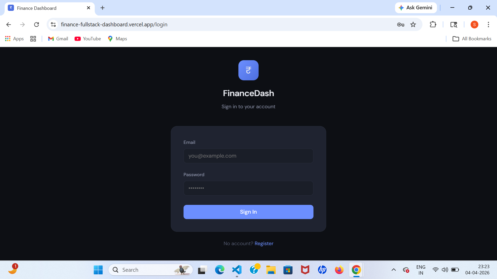
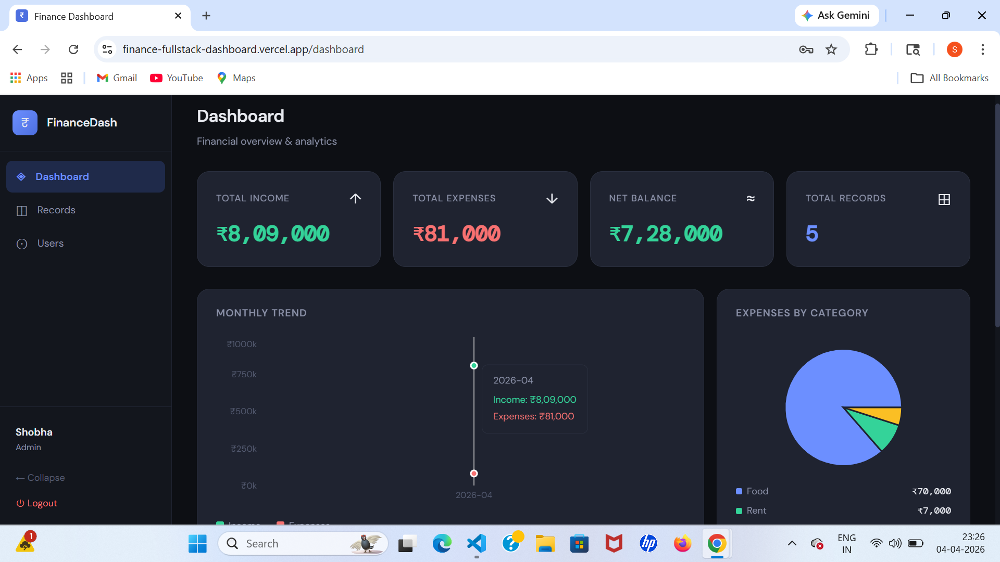
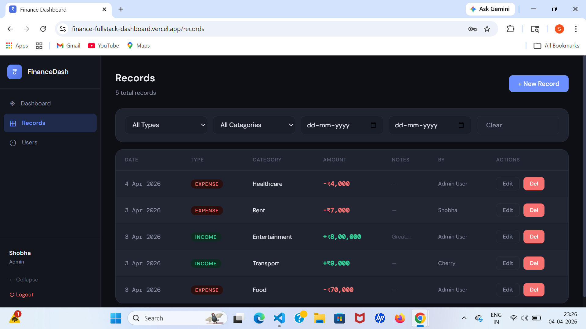
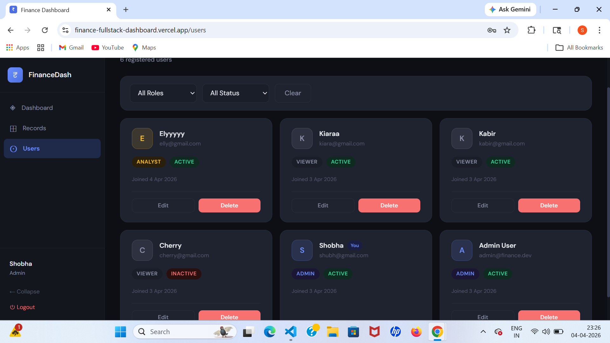

# 💰 Finance Dashboard

A full-stack finance dashboard application with role-based access control, financial records management, and analytics. Built with React on the frontend and Node.js + Express + SQLite on the backend.

🌐 **Live Demo:** https://finance-fullstack-dashboard.vercel.app

---

## 📸 Screenshots

### Login


### Dashboard


### Records


### Users


---

## ✨ Features

### 🔐 Authentication
- JWT based login and registration
- Password hashing with bcrypt
- Auto login on page refresh
- Protected routes by role

### 👥 Role Based Access Control
| Role | Records | Dashboard | User Management |
|---|---|---|---|
| Viewer | View only | ❌ | ❌ |
| Analyst | View only | ✅ | ❌ |
| Admin | Full CRUD | ✅ | ✅ |

### 📊 Dashboard Analytics
- Total income, expenses and net balance
- Monthly income vs expenses area chart
- Expense breakdown by category pie chart
- Recent activity feed
- Weekly trends

### 📁 Financial Records
- Create, view, edit and delete records
- Fields: amount, type, category, date, notes
- Filter by type, category and date range
- Pagination support
- Soft delete (data preserved for audit trail)

### 👤 User Management (Admin)
- View all users in card grid
- Edit user role and status
- Activate or deactivate accounts
- Delete users
- Filter by role and status

### 🛡️ Security
- JWT authentication with 24h expiry
- Rate limiting (200 requests per 15 min)
- CORS restricted to production domain
- Environment variables for secrets
- Input validation on all endpoints

---

## 🛠️ Tech Stack

### Frontend
- **React 18** — UI framework
- **React Router v6** — client side routing
- **Recharts** — charts and data visualization
- **CSS Variables** — dark theme design system

### Backend
- **Node.js + Express** — REST API
- **SQLite** (`sqlite` + `sqlite3`) — database
- **JWT** (`jsonwebtoken`) — authentication
- **bcryptjs** — password hashing
- **express-validator** — input validation
- **express-rate-limit** — rate limiting

### Deployment
- **Vercel** — frontend hosting
- **Render** — backend hosting

---

## 📁 Project Structure

```
finance-dashboard/
├── backend/
│   ├── src/
│   │   ├── config/
│   │   │   └── database.js        # SQLite connection and schema
│   │   ├── middleware/
│   │   │   ├── auth.js            # JWT authenticate + authorize
│   │   │   └── validate.js        # Input validation handler
│   │   ├── models/
│   │   │   ├── user.model.js      # User DB queries
│   │   │   └── record.model.js    # Record DB queries
│   │   ├── routes/
│   │   │   ├── auth.routes.js     # /api/auth/*
│   │   │   ├── user.routes.js     # /api/users/*
│   │   │   ├── record.routes.js   # /api/records/*
│   │   │   └── dashboard.routes.js # /api/dashboard/*
│   │   ├── services/
│   │   │   ├── auth.service.js    # Login and register logic
│   │   │   └── dashboard.service.js # Analytics queries
│   │   ├── utils/
│   │   │   └── errorHandler.js    # Global error handler
│   │   ├── app.js                 # Express app setup
│   │   └── index.js               # Server entry point
│   ├── .env.example
│   └── package.json
│
└── frontend/
    ├── public/
    │   └── index.html
    ├── src/
    │   ├── api/
    │   │   └── client.js          # API fetch wrapper
    │   ├── components/
    │   │   ├── auth/              # Login, Register
    │   │   ├── dashboard/         # Dashboard with charts
    │   │   ├── records/           # Records table and CRUD
    │   │   ├── users/             # User management
    │   │   ├── layout/            # Sidebar layout
    │   │   └── ui.js              # Shared UI components
    │   ├── context/
    │   │   └── AuthContext.js     # Global auth state
    │   ├── App.js                 # Routes and auth guards
    │   └── index.js               # React entry point
    └── package.json
```

---

## 🚀 Local Setup

### Prerequisites
- Node.js v18 or higher
- npm

### 1. Clone the repository
```bash
git clone https://github.com/Shobha0703/finance-fullstack-dashboard.git
cd finance-dashboard
```

### 2. Setup Backend
```bash
cd backend
npm install
cp .env.example .env
npm start
```

Backend runs at: `http://localhost:5000`

### 3. Setup Frontend
Open a new terminal:
```bash
cd frontend
npm install
npm start
```

Frontend runs at: `http://localhost:3000`

---

## ⚙️ Environment Variables

### Backend `.env`
```
PORT=5000
JWT_SECRET=your-long-random-secret-key
DB_PATH=./data/finance.db
NODE_ENV=production
```

### Frontend `.env`
```
REACT_APP_API_URL=https://your-backend-url.onrender.com/api
```

---

## 📡 Deployment

### Backend on Render
1. Create a new Web Service on [render.com](https://render.com)
2. Connect your GitHub repository
3. Set root directory to `backend`
4. Set build command to `npm install`
5. Set start command to `npm start`
6. Add environment variables

### Frontend on Vercel
1. Import your repository on [vercel.com](https://vercel.com)
2. Set root directory to `frontend`
3. Add environment variable `REACT_APP_API_URL`
4. Deploy

---

## 🗄️ Database

SQLite database with two tables:

**users** — id, name, email, password (hashed), role, status, created_at, updated_at

**records** — id, amount, type, category, date, notes, created_by, deleted_at (soft delete), created_at, updated_at

Database file is created automatically on first server start. No setup required.
